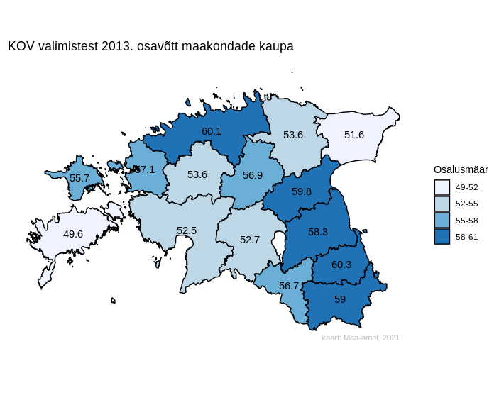

# Eesti kaart

Andmete esitamine Eesti maakondade kaardil. Selles paketis on kaks peamist funktsiooni: `kaart` ja `kaart2`: esimene näitab pildil 15 maakonda, teine lisaks veel Tallinna ja Tartut. Kaardi joonistamiseks kasutatakse `ggplot2` - see on ka ainuke eeldatav pakett, milleta läbi ei saa. Algne kood pärineb [Indrek Seppo blogipostitusest](https://analyticsestonia.wordpress.com/2013/11/21/kuidas-teha-eesti-maakaarti-r-is/) (kes lahkelt lubas seda kasutada), seda - või siis siinsete funktsioonide lähtekoodi - tasub uurida, kui tahad teistsugust kaarti, näiteks kujutada kaardil valdu või teisi linnu lisaks kahele suuremale. Siinses paketis on kaardi joonistamine tehtud mugavamaks: Eesti kaart (koos maakondade jms piirjoontega) on komplektis, seda ei ole vaja eraldi alla tõmmata ega kartograafiatarkvara abil eeltöödelda.

Kõige lihtsam on alustada kaasapandud andmestikust `osalus`: seal on kaks tunnust, mida järgnevas näites on kasutatud:

* `osalus` - arvtunnus, mis lisatakse sellisel kujul kaardile õigesse kohta (kuid see võib olla ka tekstiline tunnus, nt maakondade nimed; arvtunnuste puhul tuleks jälgida ümardamist)
* `vahemik` - järjestustunnus v faktor - selle alusel värvitakse maakonnad erineva värviga

Samale andmestikule võib lisada oma andmeid või kirjutada olemasolevate tulpade asemele. Ainsad tulbad, mida ei maksaks eriti muuta, on `maakond` (maakonna nimi peab jääma samale kujule), `x` ja `y` (maakondade tsentroidide st keskpunktide koordinaadid).

```
remotes::install_github("lebatsnok/kaart")  # paigaldamine
library(kaart)
kaart(osalus[1:15,], fill=vahemik, labels=osalus, title="KOV valimistest 2013. osavõtt maakondade kaupa",  legend.title="Osalusmäär")

# kaarditeksti (geom_text) suuruse muutmiseks sobib argument textsize
# muu teksti suuruse muutmiseks saab lisada *theme* ploki nagu allpool
kaart(osalus[1:15,], fill=vahemik, labels=osalus, title="KOV valimistest 2013. osavõtt maakondade kaupa",  legend.title="Osalusmäär", textsize=7) + theme(text=element_text(size=15))
```

  

### Märkmed

githubi parooli uuendamine: credentials::set_github_pat("ghp_minu_uus_parool")